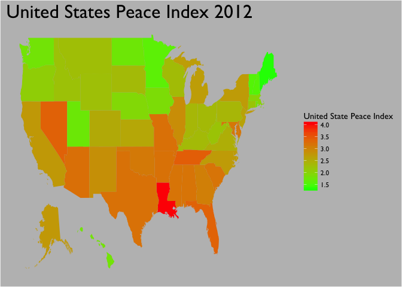

United State Peace Index on 2012
================

Data gathering and preprocessing
================================

``` r
library(rvest) #scarpping URl
library(ggplot2) #mapping the plot
library(dplyr) #data manipluation
library(fiftystater) #getting the map of USA
library(magrittr) #pipe


#getting the URL from website
url <- "https://en.wikipedia.org/wiki/United_States_Peace_Index"

#getting the html table 
US_peace_index <- url %>%
  read_html() %>%
  html_nodes(xpath='//*[@id="mw-content-text"]/div/table[3]') %>%
  html_table(fill = T)

#checking the data
head(US_peace_index)  
```

    ## [[1]]
    ##    2012 Rank 2011 Rank          State 2012 Score 2011 Score
    ## 1          1         1          Maine       1.31       1.34
    ## 2          2         2        Vermont       1.55       1.50
    ## 3          2         3  New Hampshire       1.55       1.54
    ## 4          4         4      Minnesota       1.61       1.62
    ## 5          5         8           Utah       1.72       1.83
    ## 6          6         5   North Dakota       1.74       1.71
    ## 7          7         6     Washington       1.78       1.75
    ## 8          7        12         Hawaii       1.78       1.91
    ## 9          9        10   Rhode Island       1.79       1.87
    ## 10        10        11           Iowa       1.87       1.88
    ## 11        11        13       Nebraska       1.93       2.08
    ## 12        12         7  Massachusetts       2.00       1.80
    ## 13        13         9         Oregon       2.07       1.85
    ## 14        14        15    Connecticut       2.19       2.21
    ## 15        15        17  West Virginia       2.20       2.28
    ## 16        16        16          Idaho       2.23       2.24
    ## 17        18        17        Montana       2.27       2.28
    ## 18        17        23        Wyoming       2.26       2.49
    ## 19        19        19      Wisconsin       2.30       2.30
    ## 20        20        14   South Dakota       2.32       2.17
    ## 21        20        20       Kentucky       2.32       2.39
    ## 22        22        22           Ohio       2.33       2.43
    ## 23        23        25        Indiana       2.35       2.52
    ## 24        24        21   Pennsylvania       2.37       2.42
    ## 25        25        26       Virginia       2.48       2.61
    ## 26        26        24       Colorado       2.53       2.50
    ## 27        27        27         Kansas       2.57       2.63
    ## 28        28        28     New Jersey       2.63       2.66
    ## 29        29        44       Michigan       2.69       3.30
    ## 30        30        31 North Carolina       2.71       2.79
    ## 31        31        29       New York       2.72       2.69
    ## 32        32        31     California       2.74       2.79
    ## 33        33        30         Alaska       2.75       2.70
    ## 34        34        38     New Mexico       2.85       3.16
    ## 35        35        44       Illinois       2.89       3.30
    ## 36        36        34        Georgia       3.04       2.97
    ## 37        37        39       Oklahoma       3.11       3.18
    ## 38        38        36       Maryland       3.14       3.14
    ## 39        39        36       Delaware       3.15       3.14
    ## 40        40        47        Alabama       3.17       3.50
    ## 41        40        35    Mississippi       3.17       2.98
    ## 42        42        46 South Carolina       3.18       3.42
    ## 43        43        43       Arkansas       3.20       3.27
    ## 44        43        47          Texas       3.20       3.50
    ## 45        45        40       Missouri       3.21       3.21
    ## 46        46        33        Arizona       3.22       2.89
    ## 47        47        41        Florida       3.36       3.24
    ## 48        48        49         Nevada       3.37       3.61
    ## 49        49        42      Tennessee       3.41       3.26
    ## 50        50        50      Louisiana       4.05       3.97

``` r
str(US_peace_index)
```

    ## List of 1
    ##  $ :'data.frame':    50 obs. of  5 variables:
    ##   ..$ 2012 Rank : int [1:50] 1 2 2 4 5 6 7 7 9 10 ...
    ##   ..$ 2011 Rank : int [1:50] 1 2 3 4 8 5 6 12 10 11 ...
    ##   ..$ State     : chr [1:50] "Maine" "Vermont" "New Hampshire" "Minnesota" ...
    ##   ..$ 2012 Score: num [1:50] 1.31 1.55 1.55 1.61 1.72 1.74 1.78 1.78 1.79 1.87 ...
    ##   ..$ 2011 Score: num [1:50] 1.34 1.5 1.54 1.62 1.83 1.71 1.75 1.91 1.87 1.88 ...

``` r
#conver into data frame
US_peace_index <- as.data.frame(US_peace_index)

#rename column
colnames(US_peace_index) <- c("Rank_2012", "Rank_2011", "State", "2012_score", "2011_score")

#getting USA map
data("fifty_states")

#lowercase 
US_peace_index$State <- tolower(US_peace_index$State)

#see wherether there is difference of state name between two data
setdiff(US_peace_index$State, fifty_states$id)
```

    ## character(0)

``` r
#join the data by id and state name
USA_joind <- left_join(fifty_states, US_peace_index, by = c('id' = 'State'))
```

Visaulizing the data
====================

``` r
#visualizing 
ggplot() +
  geom_polygon(data = USA_joind, aes(x = long, y = lat, group = group, fill = USA_joind$`2012_score`)) +
  labs(title = "United States Peace Index 2012") +
  scale_fill_gradient("United State Peace Index", low = 'green', high = 'red') +
  theme(
    panel.background = element_rect(fill = "grey"),
    plot.background = element_rect(fill = "grey"),
    legend.background = element_blank(),
    axis.title = element_blank(),
    axis.text = element_blank(),
    axis.ticks = element_blank(),
    panel.grid = element_blank(),
    plot.title = element_text(size = 24),
    text = element_text(family = "Gill Sans"))
```


